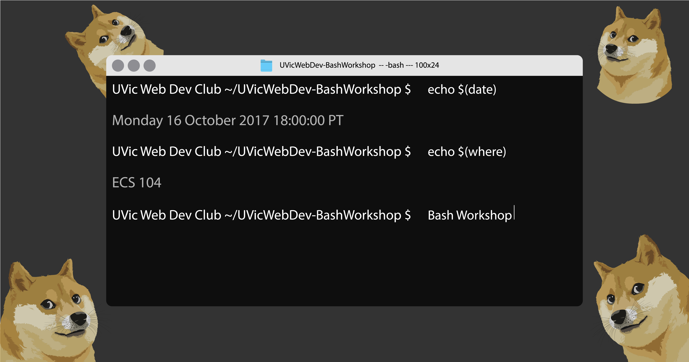

# Bash Intro
Introduction to Bash - A workshop for unix-based systems such as Linux and MAC OS X.

## Learning Outcomes

* Become familiar with bash, and the terminal. 
* Know the difference between bash, a terminal, and a console.
* Know how to navigate through the terminal.
* Create a custom bash profile.

## Workshop Outline

* Introduction
* Bash History
* Terminal History
* Console History
* Workshop
* Conclusion

## How to Prepare

Please Bring the following:

* Computer / Charger
* Happiness
* Note Pad and Pencil

Please have access to:

* UNIX Based System
* The Terminal

If you would like to participate on a windows computer, I encourage you to research and install bash on your computer.

* [I'd Start Here](https://git-for-windows.github.io/)

## Requirements

* Admin Access to your Computer
* Basic Computer Skills (Keyboard / Mouse / Search)

## Links

* [Presentation Slides](./presentation/BashWorkshop.pdf)
* [Bash Profile Sample](https://gist.github.com/FlyteWizard/03cec23c3291dfb2de26456f18f70d37)

## Resources

* http://bashrcgenerator.com/
* https://learncodethehardway.org/unix/bash_cheat_sheet.pdf

## References

* https://www.ibm.com/developerworks/library/l-linux-shells/index.html
* https://programminghistorian.org/lessons/intro-to-bash
* http://www.linfo.org/terminal_window.html
* http://hawker.me/PimpMyShell-Talk/
* https://gist.github.com/stephenll/8762279
* https://apple.stackexchange.com/questions/51036/what-is-the-difference-between-bash-profile-and-bashrc
